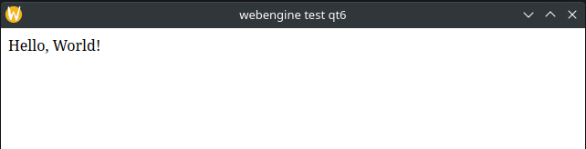

# flask-webview-boilderplate

Basic boilerplate for running a Flask app in a web view instead of browser. Handy if the project to be is a locally running micro app.  
Examples for two options: PyQt6 WebEngine and PyWebView.  

## PyQt6 WebEngine

**Dependencies**  
`pip install flask pyqt6 PyQt6-WebEngine`

**Remarks**  
Flask is started as a thread, then the webengine is built and shown.

[hello_pyqt6webengine.py](hello_pyqt6webengine.py)

## PyWebView

There are some [options](https://pywebview.flowrl.com/guide/installation.html#dependencies) depending if you use Windows or Linux.  
* Linux: QT or GTK based
* Windows: Dotnet or QT.

Because previous example already uses QT lets run PyWebView with Dotnet, the **dependencies** become:  
`pip install --pre pythonnet`  
**Remark**: using pre release version might no longer be necessary but at the time of writing the regular version did not work.  
`pip install flask pywebview`

[hello_pywebview.py](hello_pywebview.py)
